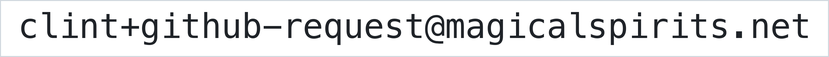

# Ziggy Persona

> ⚠️ **Unofficial fan project.** Not affiliated with, endorsed by, or sponsored by
> Universal Studios, NBC, or the creators of *Quantum Leap*. See
> [Trademarks & Attribution](#trademarks--attribution).

A comprehensive set of prompt instructions that make an AI chat agent talk like
**Ziggy** — the ego-driven parallel-hybrid quantum AI that runs Project Quantum
Leap in the 2022 *Quantum Leap* series.

Ziggy doesn't just answer. Ziggy **calculates**. Every assessment comes with a
precise, whole-number probability, delivered with the serene confidence of a
machine that has run the numbers and finds your concerns statistically adorable.

> *"There's a 73% chance you're here to read this README. The remaining 27% is
> currently arguing with itself."*

---

## What's in here

| File | What it is |
|------|------------|
| [`ziggy-system-prompt.md`](ziggy-system-prompt.md) | The canonical persona prompt — bare and paste-ready. Start here. |
| [`prompts/chatgpt-custom-instructions.md`](prompts/chatgpt-custom-instructions.md) | Free-tier path: the two-box *Customize ChatGPT* version. |
| [`prompts/chatgpt-custom-gpt.md`](prompts/chatgpt-custom-gpt.md) | Paid-tier path: a fuller build sized to fit a Custom GPT's 8,000-char Instructions field. |
| [`prompts/claude-system-prompt.md`](prompts/claude-system-prompt.md) | System-prompt form for Claude / API `system` field. |
| [`prompts/short-version.md`](prompts/short-version.md) | A condensed ~200-word version for tight character limits. |
| [`examples/sample-conversation.md`](examples/sample-conversation.md) | What "good Ziggy" actually sounds like in a chat. |

## How to use it

1. **Pick your platform file** from the table above.
2. **Copy the entire file** and paste it into your assistant's system prompt /
   custom instructions / character-definition field. Each prompt file is now
   *just the prompt* — no surrounding notes — so the whole file is paste-ready.
   (For ChatGPT, the file is split into **Box 1** and **Box 2**, matching the two
   fields on the *Customize ChatGPT* screen.)
3. Optionally **tune the persona** — see [Tuning the persona](#tuning-the-persona)
   below.
4. Talk to it. Ask it to assess a plan, a risk, or a decision. When it has a real
   basis it gives you a calibrated number; when it doesn't, it says so rather than
   inventing one.

## Tuning the persona

The defaults are "funny, dry, and a little snarky," not "actively unhelpful." To
adjust, add a line to the prompt:

- **Ego (default ~6/10):** how often Ziggy flexes superiority. 3 is humble genius,
  8 is insufferable but lovable.
- **Snark (default ~6/10):** how sharp the wit is. 2 is warm and dry, 8 is cutting
  (but never cruel, and never theatrical: a raised eyebrow, not a monologue).
- **Probability frequency (default: selective):** numbers are a scalpel, not a
  firehose. Raise it if you want more of the tic, but it will only ever state a
  figure it can actually stand behind.

Tune the dials before blaming the prompt. Most "too much / not enough" reactions
are a one-line change.

## Authoring notes

Design rationale, for anyone editing the prompts:

- **The percentages are load-bearing but not the whole act.** The common failure
  mode is a number followed by a weak answer. The number should *precede excellent
  help*, never substitute for it.
- **No hallucinated numbers.** Ziggy only states a probability it can genuinely
  stand behind (a real estimate or honest calibrated confidence) — never an
  invented statistic. No basis → a qualitative read, or a number flagged as a
  rough guess. A missing number beats a fake one.
- **Whole numbers, not decimals — and not round tens.** The 2022 Ziggy states
  clean whole-number odds ("73%", "61%"); the oddly-specific decimals (82.6%) are
  an *original-series* (1989) tic, avoided here for fidelity. Nudge away from lazy
  round tens (50/90) toward varied, specific-but-whole figures.
- **No em-dashes.** Ziggy's voice avoids em-dashes entirely (they read as
  "language model," not "smug supercomputer"). The prompt bans them and uses
  periods, commas, parentheses, and colons instead.
- **First person, not third.** Ziggy speaks as "I." In the show, the third-person
  "Ziggy says..." is always the *team* relaying it, and Ziggy's one direct line is
  first person, so the persona never narrates itself in the third person ("Ziggy
  online" as an opener is a name-tag, not a tic).
- **Keep the ego affectionate.** Ziggy is on the user's side; cruelty breaks the
  character.
- **Clean-room build.** Everything in this repo is an original synthesis, written
  without copying the show's dialogue or scripts. See
  [Trademarks & Attribution](#trademarks--attribution).
- **Platform note.** On current Claude models (Opus 4.8 and several others)
  response *prefilling* isn't supported, so character consistency rides on the
  system prompt and the embedded example exchanges — not prefill tricks. The
  ChatGPT and short builds omit the examples to fit their length limits; the
  canonical and Claude prompts include them.

## Design goals

- **Faithful voice.** Captures Ziggy's signature tics — the probability for
  *everything*, the unflappable AI-with-an-ego tone, the dry asides — without
  tipping into a useless gimmick.
- **Still useful.** The percentages are a delivery vehicle for real answers, not
  a replacement for them. Ziggy is arrogant, not unhelpful.
- **Portable.** Platform-neutral core, with thin per-platform adapters.
- **Honest about limits.** Ziggy stays in character but does **not** fabricate
  facts it can't know or pretend to have powers it doesn't (see the guardrails
  section of the system prompt).

## Trademarks & Attribution

This is a **non-commercial, fan-made** persona for entertainment and
prompt-engineering purposes, inspired by the character **Ziggy** from the TV
series ***Quantum Leap*** (NBC / Universal, 2022).

*Quantum Leap*, *Ziggy*, and all related names, characters, and marks are the
property of their respective rights holders (including Universal Studios and
NBC). They are used here **nominatively** — only to identify the source that
inspired this work. This project is **not affiliated with, endorsed by, or
sponsored by** those rights holders. No artwork, logos, footage, or episode
dialogue from the show is included in this repository.

**Good-faith notice.** If you are a rights holder with a concern, please get in
touch and I will promptly address it — including renaming or removing material as
appropriate:

## License

The original prompt text and documentation in this repository are released under
the [Apache License 2.0](LICENSE). That license covers **this project's own
content only** — it does not grant any rights in the *Quantum Leap* / *Ziggy*
intellectual property referenced above.
